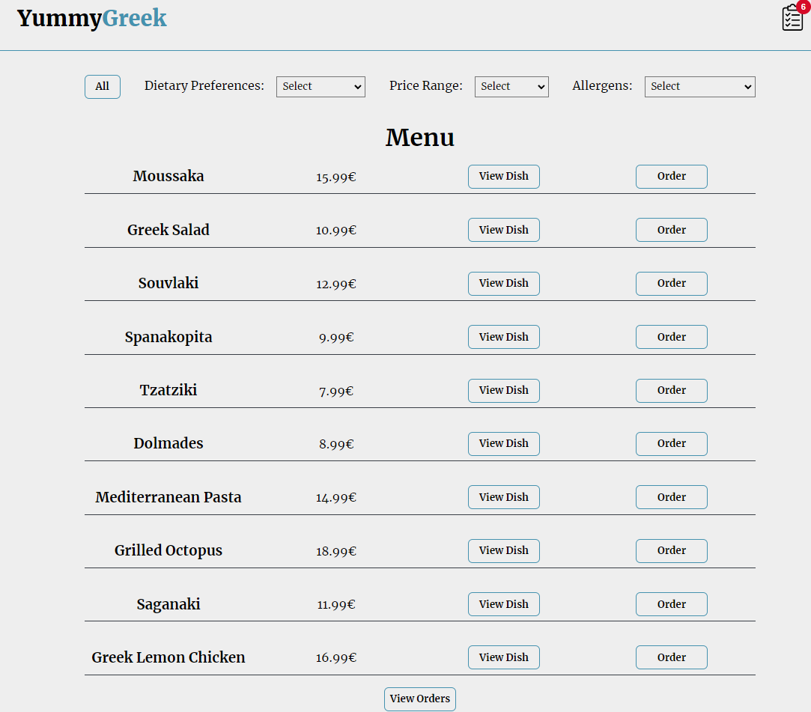

# YummyGreek
A web app that handles a restaurant menu. Filter functionality for all menu items, order and dish informations buttons.

# Technologies
The project was built in Vite + React js making use of html,css and javascript knowledge.

# What I learned and practiced
- React js components, props
- useState, useParams
- react router
- react redux
